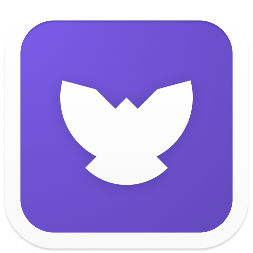

<h1 align="center" style="border-bottom: none">
    <b>
        <p> Odin</p><br>
    </b>
    ⚡ Open source easy file sharing for everyone. ⚡ <br>
</h1>


<p align="center">
<a href="https://flutter.dev/"></a>
<a href="https://github.com/odinapp/odin"></a>
<a href="https://github.com/odinapp/odin"></a>
<a href="https://github.com/odinapp/odin"></a>

</p>


<p align="center">
Cross-platform hassle-free file sharing with AES-256 encryption made with Flutter & Dart.
</p>


<p align="center">
    <a href="#Getting Started"><b>Getting Started</b></a> •
    <a href="#Roadmap"><b>Roadmap</b></a> •
    <a href="#Releases"><b>Releases</b></a>
    
    

    
</p>  

<p align="center"></p>


## Built With

* [Flutter](https://flutter.dev/)

* [Dart](https://dart.dev/)

## Getting Started

To build on MacOS or Windows, please follow these simple steps.

**Step 1:**

```shell
git clone https://github.com/odinapp/odin.git
```

**Step 2:**

```shell
cd odin
```
```shell
touch .env
```
```shell
echo 'GITHUB_TOKEN=**GITHUB_ACCESS_TOKEN**' >> .env
```
```shell
echo 'GITHUB_USERNAME=**GITHUB_USERNAME**' >> .env
```
```shell
echo 'GITHUB_TOKEN=**GITHUB_TOKEN**' >> .env
```

>
>
> These environment variables are required as Odin uses a GitHub Repo to store the uploaded files. 
> You may read GitHub docs to access these secrets.

**Step 3:**

Follow the instructions [here](https://flutter.dev/docs/get-started/install) to install Flutter. As Odin uses the `stable` channel, you need to switch the channel if you are on `dev` or `beta` channels. Just type:

```shell
flutter channel stable
```

**Step 4:**

You should enable the specified platform first if you don't enable it before and then select the desktop device.
```shell
# for windows
flutter config --enable-windows-desktop

# for macos
flutter config --enable-macos-desktop

# for linux
flutter config --enable-linux-desktop
```

**Step 5:**

To run the app just type these commands in terminal or use the Run and Debug option from your editor of choice.
```shell
flutter pub get
flutter run
```
## Roadmap

```
Roadmap
|-- AES-256 encryption
|-- Online website
|   |-- Upload and share files from any device
|   |-- View encrypted files and download them safely
|-- Upload / Download Progress
|-- File Deletion within 15 hours
|-- Same network direct sharing
```

If you'd like to propose a feature, submit an issue [here](https://github.com/odinapp/odin/issues).

## Releases

Please see the [releases tab](https://github.com/odinapp/odin/releases) for more details about the latest release.

## Contributing
First off, thanks for visiting Odin's repo and taking your time to read this doc.
Any contributions you make are **greatly appreciated**. Please look at [CONTRIBUTING.md](https://github.com/odinapp/odin/blob/main/doc/CONTRIBUTING.md) for details.

## What is Odin?
Odin began as what most projects start as "A weekend project". Originally, we wanted to develop a cross-platform, open-source file-sharing platform that was faster and easier than sharing files over chat services or data cables.
We wanted to develop and prototype the project as quickly as possible. The result was an MVP that was ready in just a few hours because we used Flutter.

> Fun Fact: The app icon resembles the helmet of the god Odin from Norse mythology. It also resembles a free-flying bird, which indicates our feelings while developing this with Flutter😊.

## License

Distributed under the AGPLv3 License. See `LICENSE.md` for more information.

## Contributers

<a href="https://github.com/odinapp/odin/graphs/contributors">
  
</a>

### If you made it here, thanks for your support. You can show more support by starring this repo. See ya! 👋