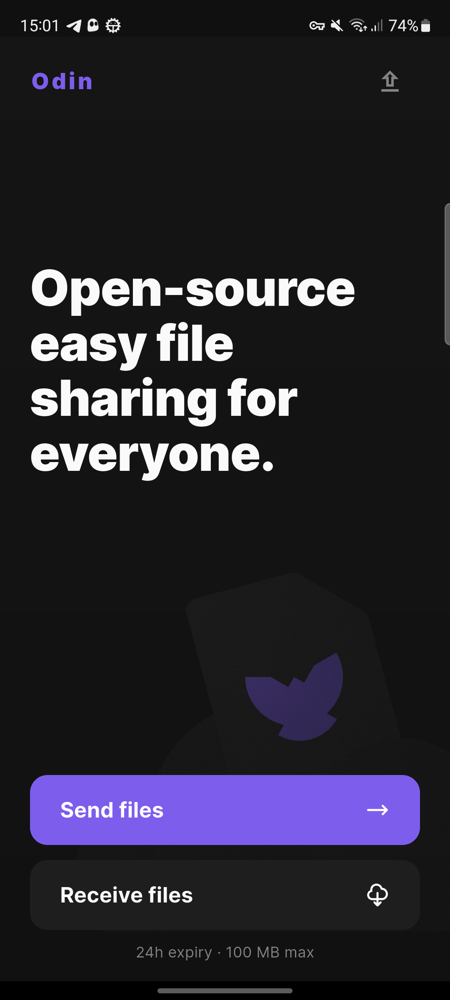
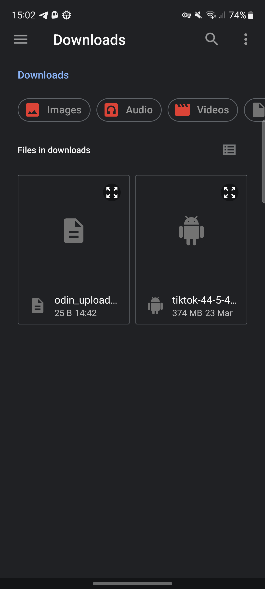
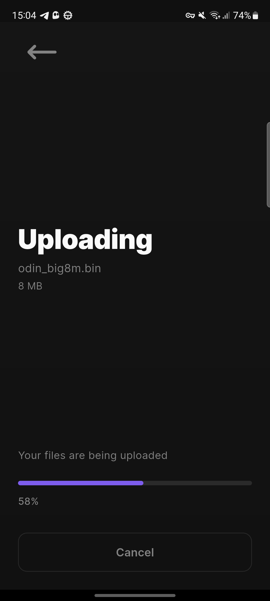
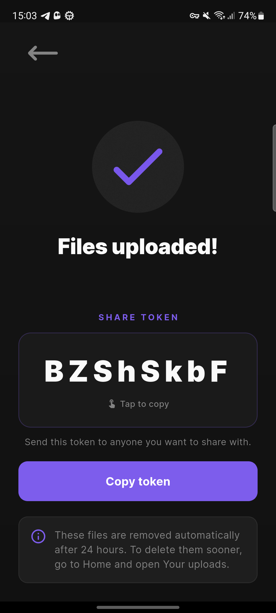
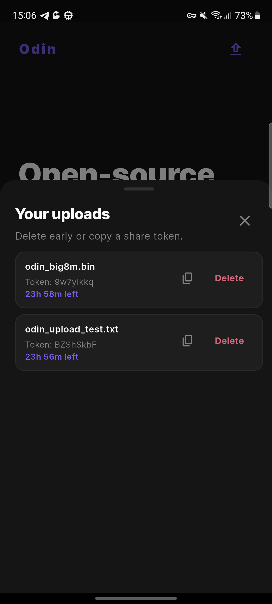
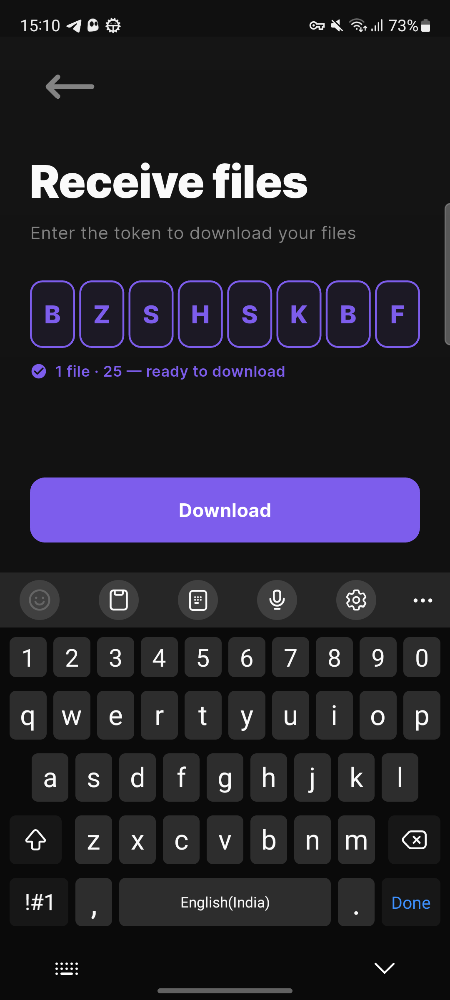
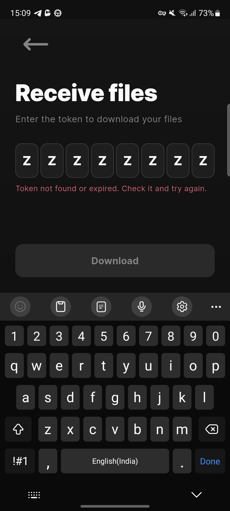
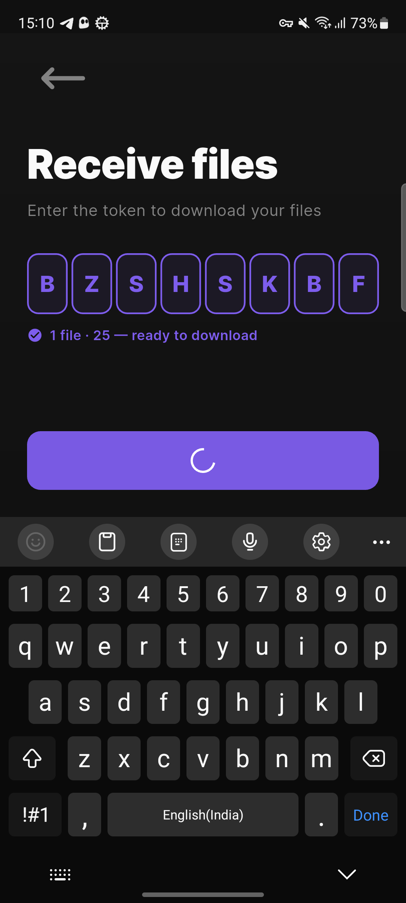
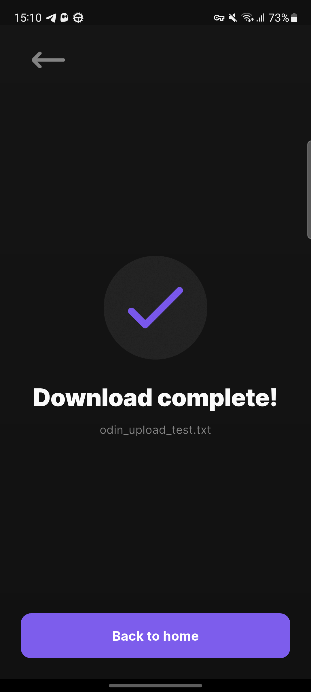

<h1 align="center" style="border-bottom: none">
    <b>
        <p> Odin</p><br>
    </b>
    ⚡ Open source easy file sharing for everyone. ⚡ <br>
</h1>


<p align="center">
<a href="https://flutter.dev/"></a>
<a href="https://github.com/odinapp/odin"></a>
<a href="https://github.com/odinapp/odin"></a>
<a href="https://github.com/odinapp/odin"></a>
<a href='https://t.me/odin_app'></a>

</p>


<p align="center">
Cross-platform, open-source file sharing with end-to-end encrypted share links built with Flutter & Dart.
</p>


<p align="center">
    <a href="#getting-started"><b>Getting Started</b></a> •
    <a href="#roadmap"><b>Roadmap</b></a> •
    <a href="#releases"><b>Releases</b></a>
    
    

    
</p>  

<p align="center"></p>

<details><summary><strong>Demo</strong></summary>
    
https://user-images.githubusercontent.com/42910433/143038817-cb935815-aea7-41c1-8b56-131cb99b0a20.mp4

</details>

### Screenshots (mobile)

Captured from a connected Android device via ADB (debug build). Paths are from the repo root. After large UI changes, recapture with the same flow and replace the files in [`docs/screenshots/`](docs/screenshots/).

**Home**

| Step | Preview |
| --- | --- |
| Home |  |

**Send files**

| Pick file | Uploading | Uploaded |
| --- | --- | --- |
|  |  |  |

**Your uploads**

| Bottom sheet |
| --- |
|  |

**Receive files**

| Valid token | Wrong token | Downloading | Downloaded |
| --- | --- | --- | --- |
|  |  |  |  |

### Screen recordings

Short screen captures of the same flows live in [`docs/videos/`](docs/videos/) (recorded with `adb shell screenrecord` on device, then pulled to the repo).

| Recording | File |
| --- | --- |
| Send flow (pick file → success) and **Your uploads** sheet | [01_flow_send_and_uploads.mp4](docs/videos/01_flow_send_and_uploads.mp4) |
| Receive flow (wrong token → valid token → download complete) | [02_flow_download_receive.mp4](docs/videos/02_flow_download_receive.mp4) |

## Built With

* [Flutter](https://flutter.dev/)

* [Dart](https://dart.dev/)

* [Cloudflare Workers + R2 + KV](https://developers.cloudflare.com/workers/)

* [`odin_core`](packages/odin_core) and [`odin_cli`](packages/odin_cli)

## Current Features

- Cross-platform Flutter app for send/receive flows
- Cloudflare Workers backend with token-based upload/download APIs
- `odin_cli` terminal client with TUI and headless modes
- Upload from files and directories (directories are zipped before upload)
- End-to-end encrypted uploads by default:
  - Payloads are encrypted client-side before upload
  - Share token contains decryption key in URL fragment (`#k=...`), which is not sent to the server
  - Legacy plaintext tokens/downloads remain supported
- Metadata pre-check on download flow
- Upload/download progress indicators
- Expiring uploads and delete-token support

## Getting Started

To build on MacOS, Windows, Linux, Android, or iOS follow these steps.

**Step 1:**

```shell
git clone https://github.com/odinapp/odin.git
```

**Step 2:**

```shell
cd odin
```

Create the `.env` file:

```shell
cat > .env <<'EOF'
API_URL=https://<your-worker>.workers.dev/
API_VERSION=v1
SUCCESSFUL_STATUS_CODE=200
EOF
```

> **Backend:** Odin uses a Cloudflare Workers backend. Deploy your own using the code in `odin-worker/`,
> then set `API_URL` to your deployment URL. The `.env` file is gitignored — never commit it.
> No GitHub credentials are required.

**Step 3:**

Install [FVM](https://fvm.app/) (Flutter Version Management), then from the repository root install the SDK pinned for this project:

```shell
fvm install
```

Odin pins the **stable** Flutter channel via `.fvmrc`. Use `fvm flutter` / `fvm dart` for all Flutter and Dart commands so you use that SDK (not a mismatched global install).

**Step 4:**

Enable the desktop embedder for your OS if you have not already, then pick the desktop device when running.

```shell
# for windows
fvm flutter config --enable-windows-desktop

# for macos
fvm flutter config --enable-macos-desktop

# for linux
fvm flutter config --enable-linux-desktop
```

**Step 5:**

To fetch packages and run the app (from the repo root):

```shell
fvm flutter pub get
fvm flutter run
```

**Editor tip:** Point your IDE’s Flutter SDK path to `.fvm/flutter_sdk` inside this repo so analysis and device selection match FVM.

### Verify your setup

From the repo root:

```shell
fvm flutter analyze --no-fatal-infos
fvm flutter test
```

For Android: `fvm flutter build apk` (debug or release). For Linux desktop, install the [Flutter Linux prerequisites](https://docs.flutter.dev/platform-integration/linux/setup) (for example `cmake`, `ninja-build`, and GTK development packages), then run `fvm flutter build linux` or `fvm flutter run -d linux`.

## Roadmap

### Done

- [x] Flutter send/receive experience for mobile + desktop
- [x] Cloudflare Worker backend (`upload`, `download`, `info`, `delete`)
- [x] Upload/download progress in app and CLI
- [x] `odin_core` package as shared upload/download logic
- [x] `odin_cli` package with TUI + headless/script-friendly mode
- [x] Directory upload support (zip-then-upload)
- [x] End-to-end encrypted share tokens with key fragment support
- [x] Backward-compatible plaintext token download support

### Next

- [ ] Streaming/chunked encryption for very large files
- [ ] Optional auto-extract after encrypted zip download
- [ ] Clipboard + QR improvements for encrypted share tokens in CLI/TUI
- [ ] Optional web upload/download client that uses the same `odin_core` protocol
- [ ] Better key rotation/revocation UX for shared links
- [ ] Multi-recipient sharing with per-recipient key wrapping
- [ ] LAN/direct local transfer mode (same network)
- [ ] Signed releases for CLI binaries

If you'd like to propose a feature, submit an issue [here](https://github.com/odinapp/odin/issues).

## Releases

Please see the [releases tab](https://github.com/odinapp/odin/releases) for more details about the latest release.

## Contributing
First off, thanks for visiting Odin's repo and taking your time to read this doc.
Any contributions you make are **greatly appreciated**. Please look at [CONTRIBUTING.md](https://github.com/odinapp/odin/blob/main/doc/CONTRIBUTING.md) for details.

## What is Odin?
Odin began as what most projects start as "A weekend project". Originally, we wanted to develop a cross-platform, open-source file-sharing platform that was faster and easier than sharing files over chat services or data cables.
We wanted to develop and prototype the project as quickly as possible. The result was an MVP that was ready in just a few hours because we used Flutter.

> Fun Fact: The app icon resembles the helmet of the god Odin from Norse mythology. It also resembles a free-flying bird, which indicates our feelings while developing this with Flutter😊.

## License

Distributed under the GPL-3.0 License. See `LICENSE` for more information.

## Contributers

<a href="https://github.com/odinapp/odin/graphs/contributors">
  
</a>

### If you made it here, thanks for your support. You can show more support by starring this repo. See ya! 👋
