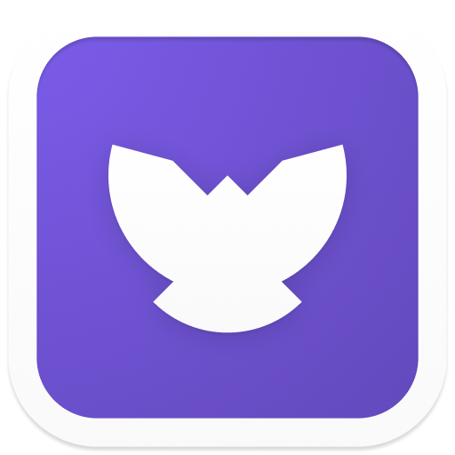
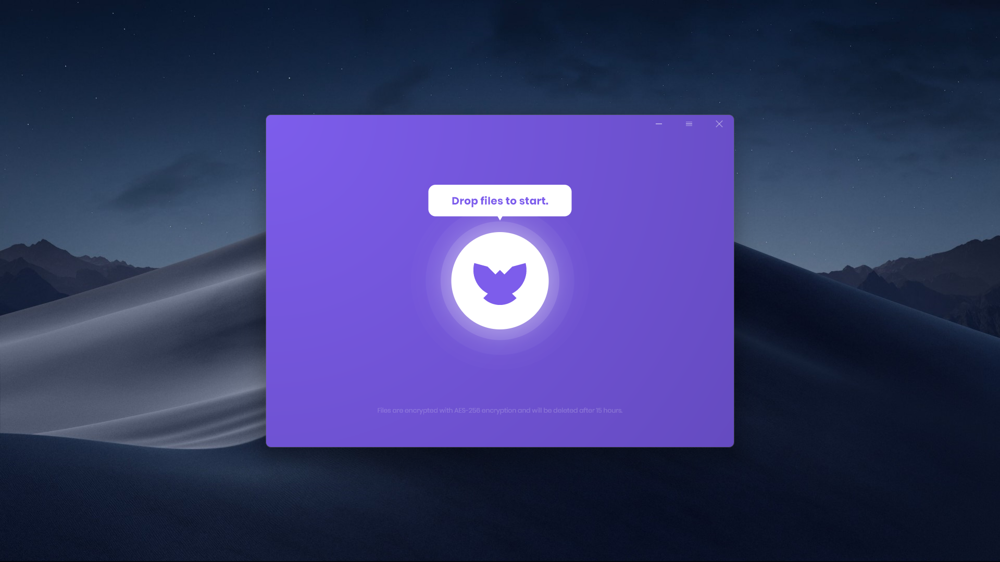

<h1 align="center" style="border-bottom: none">
    <b>
        <p> Odin</p><br>
    </b>
    ⚡ Open source easy file sharing for everyone. ⚡ <br>
</h1>


<p align="center">
<a href="https://flutter.dev/"></a>
<a href="https://github.com/odinapp/odin"></a>
<a href="https://github.com/odinapp/odin"></a>
<a href="https://github.com/odinapp/odin"></a>
<a href='https://t.me/odin_app'></a>

</p>


<p align="center">
Cross-platform hassle-free file sharing with AES-256 encryption made with Flutter & Dart.
</p>


<p align="center">
    <a href="#getting-started"><b>Getting Started</b></a> •
    <a href="#roadmap"><b>Roadmap</b></a> •
    <a href="#releases"><b>Releases</b></a>
    
    

    
</p>  

<p align="center"></p>

<details><summary><strong>Demo</strong></summary>
    
https://user-images.githubusercontent.com/42910433/143038817-cb935815-aea7-41c1-8b56-131cb99b0a20.mp4

</details>
    

## Built With

* [Flutter](https://flutter.dev/)

* [Dart](https://dart.dev/)

## Getting Started

To build on MacOS or Windows, please follow these simple steps.

**Step 1:**

```shell
git clone https://github.com/odinapp/odin.git
```

**Step 2:**

```shell
cd odin
```
```shell
touch .env
```
```shell
echo 'GITHUB_TOKEN=**GITHUB_ACCESS_TOKEN**' >> .env
```
```shell
echo 'GITHUB_USERNAME=**GITHUB_USERNAME**' >> .env
```
```shell
echo 'GITHUB_TOKEN=**GITHUB_TOKEN**' >> .env
```

>
>
> These environment variables are required as Odin uses a GitHub Repo to store the uploaded files. 
> You may read GitHub docs to access these secrets.

**Step 3:**

Install [FVM](https://fvm.app/) (Flutter Version Management), then from the repository root install the SDK pinned for this project:

```shell
fvm install
```

Odin pins the **stable** Flutter channel via `.fvmrc`. Use `fvm flutter` / `fvm dart` for all Flutter and Dart commands so you use that SDK (not a mismatched global install).

**Step 4:**

Enable the desktop embedder for your OS if you have not already, then pick the desktop device when running.

```shell
# for windows
fvm flutter config --enable-windows-desktop

# for macos
fvm flutter config --enable-macos-desktop

# for linux
fvm flutter config --enable-linux-desktop
```

**Step 5:**

To fetch packages and run the app (from the repo root):

```shell
fvm flutter pub get
fvm flutter run
```

**Editor tip:** Point your IDE’s Flutter SDK path to `.fvm/flutter_sdk` inside this repo so analysis and device selection match FVM.

### Verify your setup

From the repo root:

```shell
fvm flutter analyze --no-fatal-infos
fvm flutter test
```

For Android: `fvm flutter build apk` (debug or release). For Linux desktop, install the [Flutter Linux prerequisites](https://docs.flutter.dev/platform-integration/linux/setup) (for example `cmake`, `ninja-build`, and GTK development packages), then run `fvm flutter build linux` or `fvm flutter run -d linux`.

## Roadmap

```
Roadmap
|-- AES-256 encryption
|-- Online website
|   |-- Upload and share files from any device
|   |-- View encrypted files and download them safely
|-- Upload / Download Progress
|-- File Deletion within 15 hours
|-- Same network direct sharing
```

If you'd like to propose a feature, submit an issue [here](https://github.com/odinapp/odin/issues).

## Releases

Please see the [releases tab](https://github.com/odinapp/odin/releases) for more details about the latest release.

## Contributing
First off, thanks for visiting Odin's repo and taking your time to read this doc.
Any contributions you make are **greatly appreciated**. Please look at [CONTRIBUTING.md](https://github.com/odinapp/odin/blob/main/doc/CONTRIBUTING.md) for details.

## What is Odin?
Odin began as what most projects start as "A weekend project". Originally, we wanted to develop a cross-platform, open-source file-sharing platform that was faster and easier than sharing files over chat services or data cables.
We wanted to develop and prototype the project as quickly as possible. The result was an MVP that was ready in just a few hours because we used Flutter.

> Fun Fact: The app icon resembles the helmet of the god Odin from Norse mythology. It also resembles a free-flying bird, which indicates our feelings while developing this with Flutter😊.

## License

Distributed under the GPL-3.0 License. See `LICENSE` for more information.

## Contributers

<a href="https://github.com/odinapp/odin/graphs/contributors">
  
</a>

### If you made it here, thanks for your support. You can show more support by starring this repo. See ya! 👋
